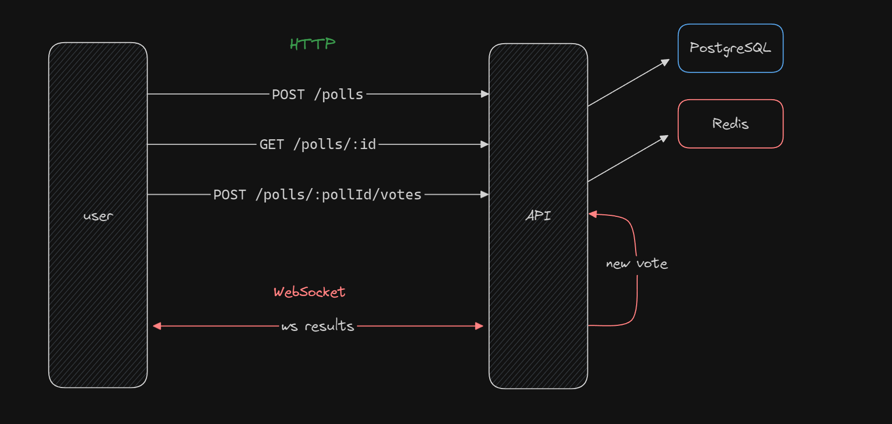

<h1 align="center" style="display: flex; align-items: center; width: 100%; justify-content: center; gap: 1rem;" >
    
Polls

</h1>

Este é um projeto back-end do desenvolvimento de uma API para criação, votação e checagem em tempo real via WebSockets de uma votação. 

  <a href="#-tecnologias">Tecnologias</a>&nbsp;&nbsp;&nbsp;|&nbsp;&nbsp;&nbsp;
  <a href="#-projeto">Projeto</a>&nbsp;&nbsp;&nbsp;|&nbsp;&nbsp;&nbsp;
  <a href="#-layout">Layout</a>&nbsp;&nbsp;&nbsp;|&nbsp;&nbsp;&nbsp;
  <a href="#memo-licença">Licença</a>

  

 

  

## 🚀 Tecnologias

Esse projeto foi desenvolvido com as seguintes tecnologias:

- HTML, CSS e JavaScript
- Git e Github
- Biblotecas:
    - [nodejs](https://nodejs.org/en)
    - [typescript](https://www.typescriptlang.org/)
    - [prisma](https://www.prisma.io/)
    - [fastify](https://fastify.dev/)
    - [@fastify/cookies](https://github.com/fastify/fastify-cookie)
    - [@fastify/websocket](https://github.com/fastify/fastify-websocket)
    - [zod](https://zod.dev/)
    - [ioredis](https://github.com/redis/ioredis)
    - [docker](https://www.docker.com/)

    Database:
    - [postgresql](https://www.typescriptlang.org/)
    - [redis](https://redis.io/)

## 💻 Projeto

Esse projeto foi baseado na semana da NLW da Rocketseat, onde foi ensinado como fazer uma aplicação com o uso de dois bancos de dados, integrados ao Docker e orientados pelo PrismaORM.

## :memo: Licença

Esse projeto está sob a licença MIT.

---

## ✍ Author
 

    Made with 💜 by Pedro Henrique Klein

    
    

